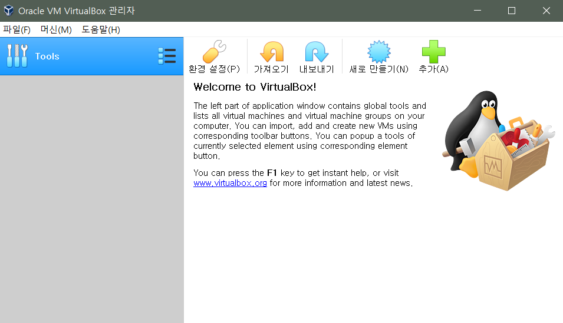

# Setup

## Docker

>  Window 10 Home edition이라서 Hyper-V를 사용할 수 없으므로, 노트북에서는 강의자가 제안하는 대로 Virtual Box를 다운로드하여 사용하자. ~~WSL 2에서 Docker 사용하는 방법도 고려해 봤지만, 아직 윈도우 버전 업데이트도 안 했고, Docker를 제대로 배우기 전이므로 이건 나중에~~

* [VirtualBox](https://www.virtualbox.org/wiki/Downloads)에서 VirtualBox 6 다운로드

  

* [Django-Python-Advanced-Ubuntu 18.ova](https://drive.google.com/u/0/uc?export=download&confirm=Fuym&id=1LU_GQTAx4Tn72c0aYTsfgu17ajOzl3fZ) 다운로드

