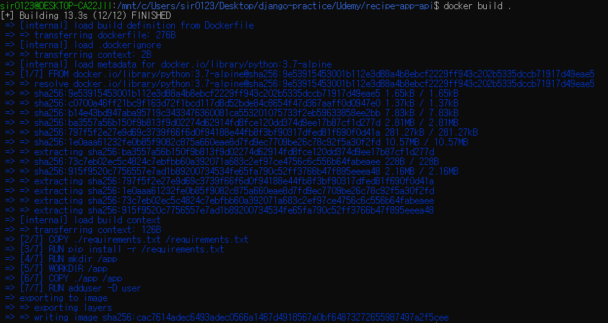
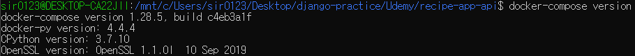
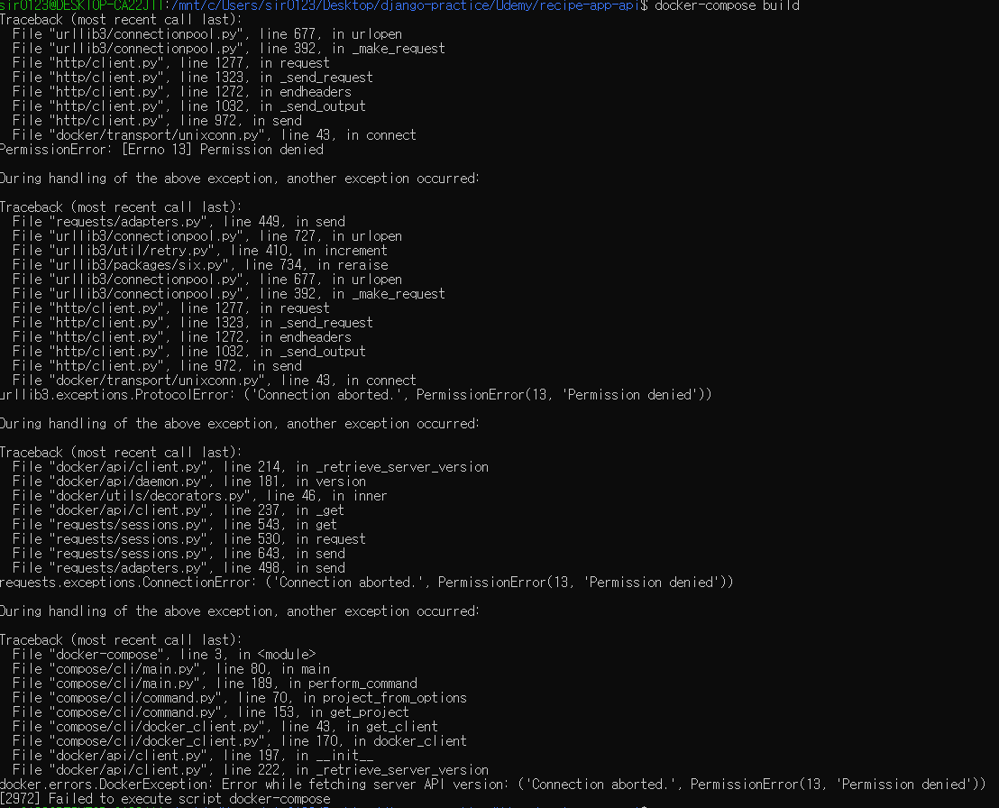

# Project Setup


## Docker

* [Dockerfile](https://docs.docker.com/engine/reference/builder/): **list of instructions** for a Docker to build a Docker image

  ```dockerfile
  # base, maintainer(optional)
  FROM python:3.7-apline
  MAINTAINER sirzzang
  
  # Python unbuffered mode
  ENV PYTHONUNBUFFERED 1
  
  # copy requirements.txt and run install
  COPY ./requirements.txt /requirements.txt
  RUN pip install -r /requirements.txt
  
  # directory to store application source codes
  RUN mkdir /app
  WORKDIR /app
  COPY ./app /app
  
  # create user and switch
  RUN adduser -D user # run processes only
  USER user
  ```

  * describe all the dependencies for the project

  * root directory에 file name `Dockerfile` 

  * 명령어는 보통 대문자

  * base: image to be inherited

    * [docker hub](https://hub.docker.com/): base로 사용할 수 있는 image 리스트 검색

      

    * [Python 3.7 Alpine](https://github.com/docker-library/python/blob/8167dd2574bb503a131d262c0c5721c6ba02c928/3.7/alpine3.13/Dockerfile) 이미지 사용: lightweight version of Docker running python 3.7

      

  * maintainer: optional

  * python unbuffered

    * python run in unbuffered mode, recommended when running Python in Docker containers
    * not allow Python to buffer the outputs = print output directly. 
    * avoid complications with the Docker image

    > *참고* : Python Unbuffered?
    >
    > * https://stackoverflow.com/questions/59812009/what-is-the-use-of-pythonunbuffered-in-docker-file/59812588
    > * https://www.reddit.com/r/learnpython/comments/5ebkq6/what_does_pythonunbuffered1_do/
    > * [Data Buffer](https://en.wikipedia.org/wiki/Data_buffer) 개념
    > * https://www.44bits.io/ko/post/almost-perfect-development-environment-with-docker-and-docker-compose: 도커 컴포즈에서 파이썬 로그가 늦게 출력되는 것을 방지하기 위한 환경변수 추가(설정할 값은 0이든 1이든 무관)

  * requirements.txt: store dependencies
    * copy requirements.txt file on the Docker image 
    * run pip install: take requirements file and install by using pip into Docker

  * create directory
    * create an empty folder
    * switches to the folder as the default directory = any application running on the docker container will run from this location unless certain location is specified
    * copy from local machine the app folder to the app on the docker image

  * create user that is going to run application using docker
    * create `user`: `-D`  for running applications **only**, for security
    * switch to that user

* requirements

  * Django 2.1.3
  * django rest framework 3.9.0 

* empty folder: `app`


 <br>

 이제 도커 이미지를 빌드해 보자!


<center><sup>Permission Denied 에러</sup></center>


<center><sup>FrontEnd docker file load 에러 </sup></center>



<center><sup>오타 수정 후 빌드 성공 </sup></center>

* WSL2 ubuntu 터미널을 사용하므로, `/mnt` 붙여서 경로 이동
* permission denied
  * 사용자가 root:docker 권한을 가지도록 변경하는 것은 권장되지 않으므로, [사용자를 docker group에 포함시켜 준다](https://technote.kr/369)
  * [여기도 참고](http://www.kwangsiklee.com/2017/05/%ED%95%B4%EA%B2%B0%EB%B0%A9%EB%B2%95-solving-docker-permission-denied-while-trying-to-connect-to-the-docker-daemon-socket/)해서 완전히 로그아웃 후 다시 로그인해 사용한다
  * 근데도 안 되어서 [그룹 내 사용자도 접근 가능하게 다시 변경](https://github.com/occidere/TIL/issues/116)을 해 봤다
  * 그리고 터미널 다시 열어서 접속했더니 되었다
* failed to solve frontend dockerfile.v0 : 알고 보니 Dockerfile 오타(;;)

```bash
$ docker build .
```


## Docker Compose

>  *참고*: Docker Compose [버전 확인](https://docs.microsoft.com/ko-kr/visualstudio/docker/tutorials/use-docker-compose)
>
> 


[Docker Compose](https://docs.docker.com/compose/)

* a tool allowing running Docker image easily from project location
* easily manage different services making up the project (*ex*) Python, database, ...


<br>

* 프로젝트 루트 디렉토리에 `docker-compose.yaml` YAML 파일 생성: 프로젝트를 구성하는 모든 서비스의 configuration

  ```yaml
  # version
  version: "3"
  
  # define services that make up the application
  services:
    app:
      build:
        context: .
      ports:
        - "8000:8000"
      volumes:
        - ./app:/app
      command: >
        sh -c "python manage.py runserver 0.0.0.0:8000"
  ```

  * **service** called `app`
  * **build** section configuration: set the context to `.`(=current directory running Docker compose from)
  * **port** configuration: from port `8000` to host image
  * **volume** configuration: get updates made to Docker image 
    * map volume from local machine to Docker container that will be running the application
    * change automatically updated in the container = no need to restart Docker
  * **command** configuration: `>` 이용해 다음 줄에 작성
    * `sh`: shell run command
    * `python manage.py runserver 0.0.0.0.:8000`: Django development server를 Docker에서 실행하는 모든 IP 주소(`0.0.0.0`)에서 실행, 포트는 8000
    * 실행 후 로컬에서는 8000 포트로 연결

<br>

 이제 docker-compose를 빌드해 보자!

```bash
$ docker-compose build
```



<center><sup>Permission Denied 에러</sup></center>


<center><sup>cmd에서 빌드</sup></center>

* Permission 에러: WSL 우분투 터미널에서는 에러나는데, 윈도우 cmd 터미널에서는 정상
  * 강의자가 정리해 놓은 참고 자료: https://www.udemy.com/course/django-python-advanced/learn/lecture/16360398#notes


