# Postgres


> *참고*: 질문
>
> * `patch` 사용법 *cf. effective python*
> * `test_wait_for_db`에서 `patch` decorator와 `with patch`의 역할 구분
> * 원래 커맨드를 상속하니까, Django에서 제공되는 기본 커맨드는 다 사용할 수 있고, 거기에 wait_for_db를 사용할 수 있게 되는 건가?

<br>


## Mocking with Unittests


 **Mocking**

* overriding or changing the behavior of the dependencies of the code that is being tested

* avoid unintended side effects and isolate specific piece of the code to be tested

  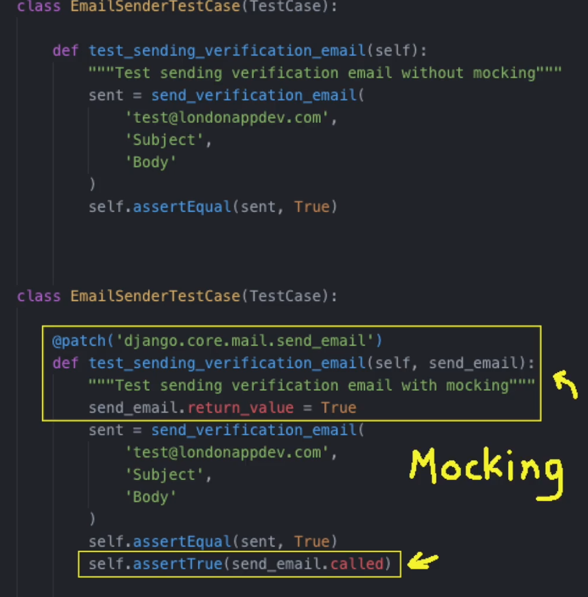


<br>

> *참고*: mocking example
>
>  이메일을 보내는 함수를 테스트하는 상황을 상상해 보자. 테스트를 실행할 때마다 항상 이메일을 보내지 말아야 하는 이유가 있다.
>
> * never write tests **depending** on **external services**
>   * cannot guarantee the availability of them
>   * unpredictable, unreliable tests
> * sending spam emails
> * clogging up email server
>
> <br>
>
>  이러한 상황에 mocking을 사용해 실제 이메일을 보내서 테스트하는 경우를 방지한다.
>
> 
>
> * override the function in the dependency(*= that sends the email*), and replace it with a mock object
>
> 
>
> * avoid sending actual email by using the mock object
> * just check that if the function was called with the **correct** parameters

<br>

## :one: tests for waiting for db

* add management command to the core app of the Django project

* management command: helper command
  * wait for the database to be available before continuing and running other commands
  * use in docker-compose when starting Django app

* management command를 사용하는 이유? = **reliability** 
  * 종종 Django app을 시작할 때 database error 때문에 실패하는 경우 발생
  * Postgres 서비스가 시작되면, 연결 전 셋업을 위해 이루어져야 하는 작업이 있음
  * Django 앱이 database가 준비되기 전에 연결을 시도하려고 하면 실패하고, 재시작 필요
  * 따라서 helper command로서 management command를 사용하여 database가 준비되었고, 연결될 수 있음을 확인할 필요

<br>

* `app/core/tests/test_commands.py`: `wait_for_db` command를 위한 테스트 코드 작성

  ```python
  
  ```

  * import
    * `patch`: allowing to mock the behavior of the Django `get_database` function
      * dd
    * `call_command`: 
    * `OperationalError`
    * `TestCase`
  * `test_wait_for_db_ready`: command를 입력하고 database 연결이 가능할 때, 어떤 일이 일어나는지 테스트
    * database를 사용할 수 있을 때, 어떤 일이 일어날지 시뮬레이션으로 정해야
      * try and retrieve the database connection from Django
      * check if when we try and retrieve, it retrieves an operational error or not
    * override the behavior of `ConnectionHandler`
  * `test_ wait_for_db`: database 5번, 6번째에 성공 및 이후 작업 계속
    * while loop to check if the `ConnectionHandler` raises the operational error
    * if it does raise operational error?
      * wait a second: mocking `time.sleep`
      * and then try again
    * `patch` decorator: pass in as an argument to our function
      * additional argument를 사용하지 않더라도 인자로 넘기지 않으면 오류
      * `patch` decorator를 통해 감싸진 mock의 역할: `time.sleep`의 역할 대체

* test: `wait_for_db` 코드를 작성하지 않았으므로 fail!

  > *참고*: 그 전에 docker login 에러
  >
  > 
  >
  >  docker hub에 회원가입 후 로그인([참고](https://nirsa.tistory.com/46)) 했는데도 에러
  >
  > 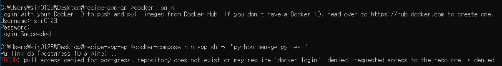
  >
  > 알고 보니 docker-compose 파일 오타였다.ㅎ. ~~정신 줄좀~~

  

<br>

## :two: add wating for db command


**Django Recommended**

 command를 만들기 위해 core app에 디렉토리 생성. `management` 폴더 이름.

<br>

 전부 다 `__init__.py` 파일로 모듈화. 

* `app/core/management`
* `app/core/management/commands`

<br>

* `app/core/management/commands/wait_for_db.py`

  ```python
  
  ```

  * import
    * 
    * `OperationalError`: Django will throw when database is not available
    * `BaseCommand`: custom command를 만들기 위한 base command. Django에서 기본 제공
  * `Command`: 커스텀 command class, `BaseCommand` 상속
    * `*args, **options`: custom management command options
    * `self.stdout.write`: print message
    * `self.style.SUCCESS`: success style, output message in green

* 테스트: 성공!       *cf. 성공 메시지 초록색*

  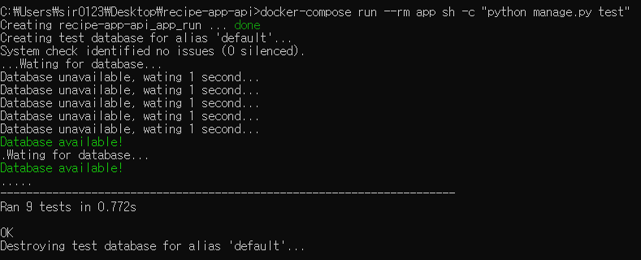

  * delays


<br>

## :three: docker compose for waiting for db

 docker-compose에서 Django 앱을 시작하기 전에  `wait_for_db` command를 사용할 수 있도록!

<br>

* `docker-compose.yml`

  * `manage.py`에서 `wait_for_db` 커맨드 실행 후, `migrate` 커맨드 실행해 database migration 실행한 후, 서버 실행하도록 커맨드 변경
  * migration 커맨드
    * django app에 필요한 테이블을 생성
    * migration 없이 바로 서버 실행하면 문제 발생

* 실행: `docker-compose up` 

  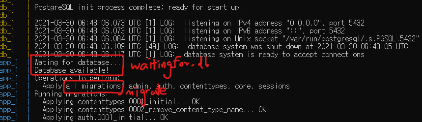

  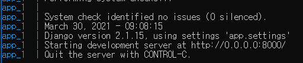

<center><sup>development server 실행</sup></center>

* 테스트, flake8

  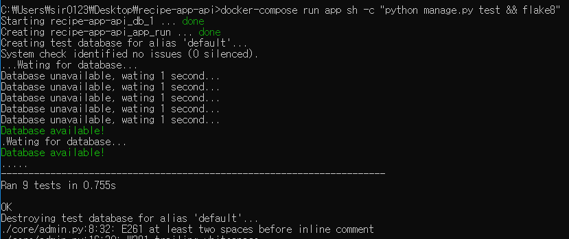

<center><sup>flake 8...</sup></center>

<br>

## :four: test in browser

  브라우저를 이용해 admin page에 로그인하고, 모든 model이 admin page에 제대로 추가되었는지 확인.

* docker-compose를 통해 서버 실행: `docker-compose up`

* 개발 서버: `127:0.0.1:8000` local 서버 이용

  * 터미널에 나온 주소를 사용하지 않음. docker container의 internal connection 목적
  * `localhost`: forward port 8000 into our conatiner

  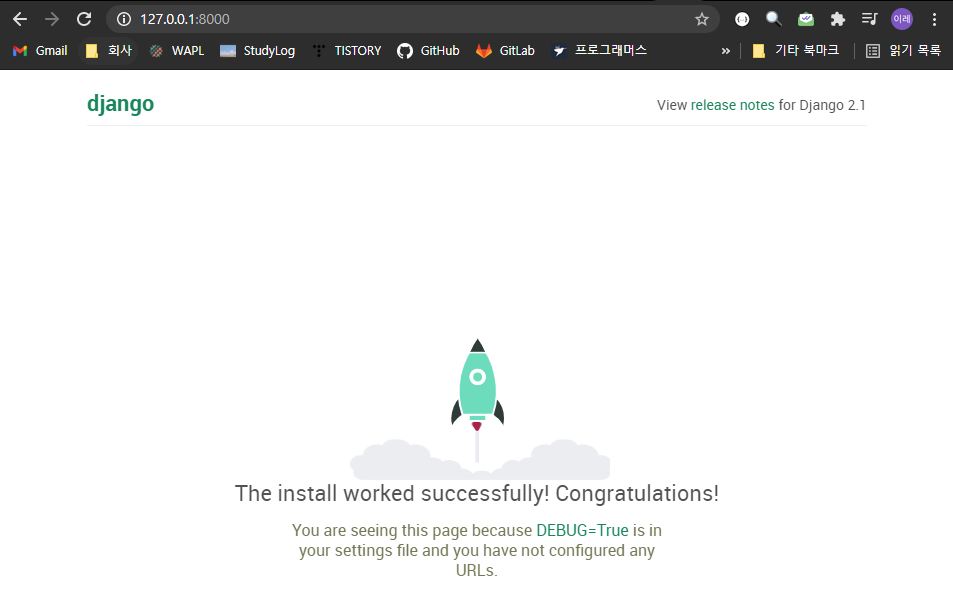

* `127.0.0.1:8000/admin`: admin Django administration

  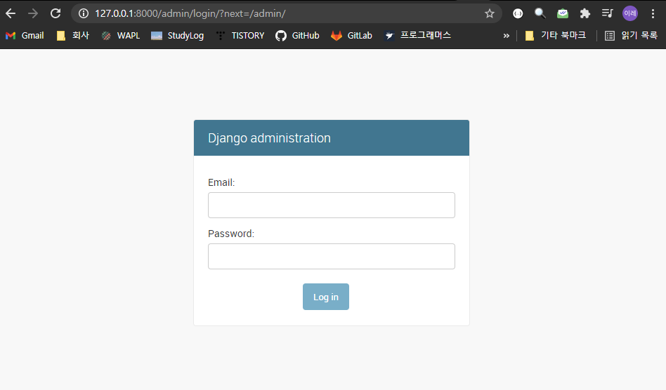

  * create superuser: `docker-compose run app sh -c "python manage.py create superuser"`

    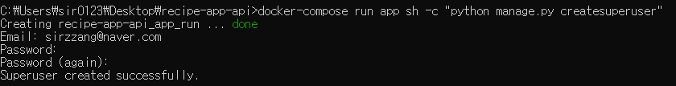

    * 이메일 주소
    * 패스워드

  * 만든 관리자(superuser) 계정으로 로그인: `Core` 앱에 `Users` 모델이 생성

    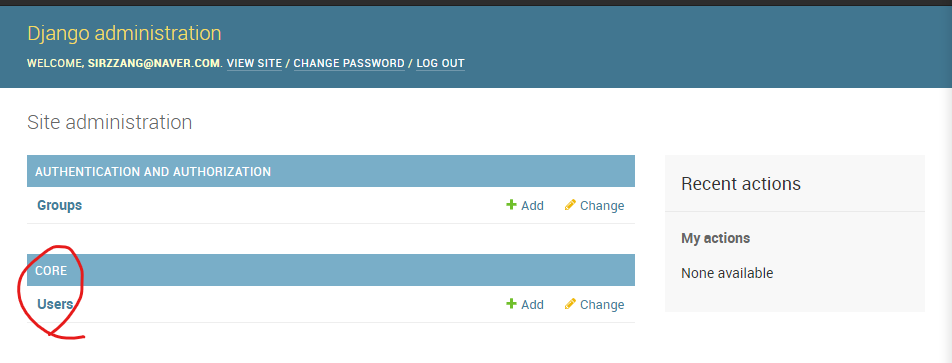

  * `user` 모델 안에 조회, add 등의 페이지 있음

    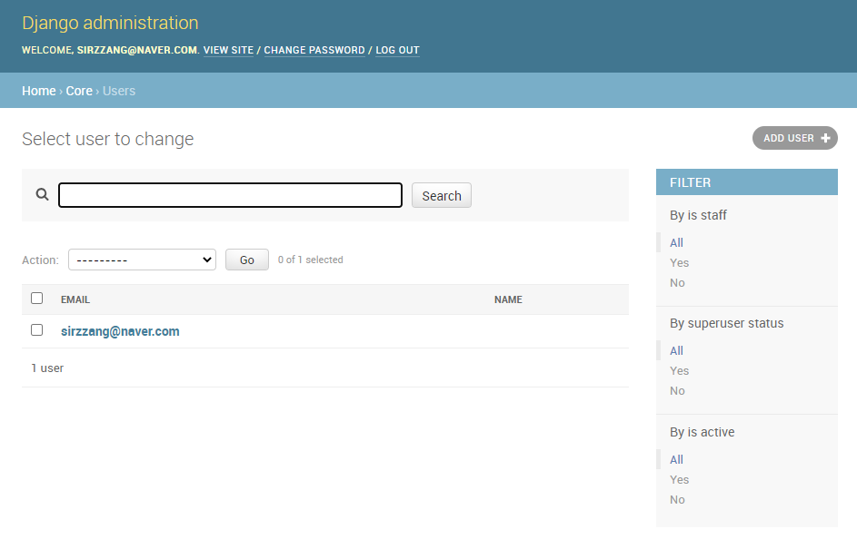

    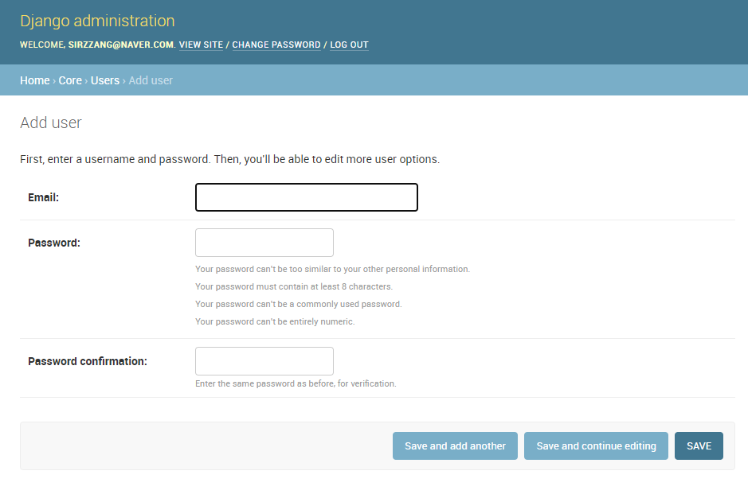

    


