# User Management Endpoint


> *질문*
>
> * create user API가 public이 되어도 되는 이유 제대로 이해 안 됨
> * :two:에서 testing password short 어떤 부분이 fix되었는지 다시 볼 것
> * :three:에서 django rest framework, create 함수가 하는 과정 이해
> * :four:에서 create token의 장점으로 강의자가 한 말이, 그냥 평상시에 API 요청 보낼 때 token 발급받는 것과 같은 원리인가?
> * :four:에서 unit test 진행할 때처럼 모든 경우 다 하나 하나 생각해서 단위 테스트로 만들어야 하나? 저기서 없는 경우는? ▶ 안 그래도 강의자가 언급한 부분이다! not possible to create too many tests. 가능한 한 많은 케이스 시나리오 생각해서 테스트를 하자! 더 추가해도 된다!
> * :five:에서 왜 migration 적용되지 않았지?
> * :six:에서 애초에 저 401, 405 요청 오는 거는 장고 자체에서 다 되어 있는 건가?

<br>


## :one: User 앱 만들기


 **User Management Endpoint**

* create users
* update users
* change a user's password
* create user authentication tokens to authenticate requests to the other APIs in the project

<br>

 먼저 Django 프로젝트에 `Users` 앱을 만든다. 루트 디렉토리의 `app` 아래에 `app`, `core`라는 앱이 있는데, 그 외에 `user`라는 새로운 앱을 만든다. 

* `docker-compose run --rm app sh -c "python manage.py startapp user"`

  

  * `--rm`: 커맨드 실행 후 컨테이너 제거. 한 번만 실행하고 싶을 경우. prevent docker container lingering on the system

  

<br>

 `user` 앱이 생성되었다.

* `migrations`, `admin.py`, `models.py`, `tests.py` 삭제

  * core app에서 migration, admin, models 관리

  * tests는 새로운 하위 폴더 생성하여 관리: `app/user/tests`(init 파일 필요)

    | before                                                       |                            after                             |
    | ------------------------------------------------------------ | :----------------------------------------------------------: |
    | 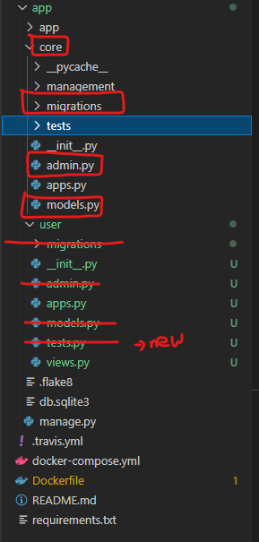 | 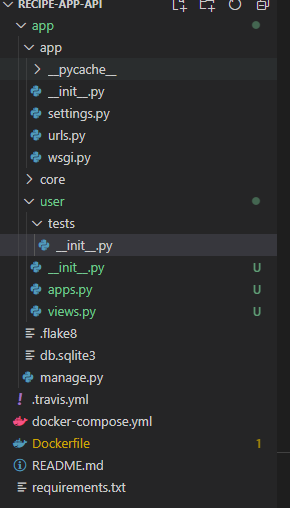 |

* 앱 추가: `app/app/settings.py`

  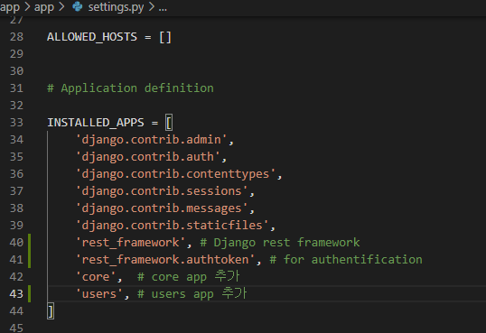

  * Django rest framework: `rest_framework`
  * authentification: `rest_framework.authtoken`
  * users 앱: `users`

<br>

## :two: create user API 테스트


**create users API**

 유저를 생성하는 API. 유저를 생성하기 위해 POST 요청을 보내야 하는 다양한 상황에 대해 생각해 보자.

<br>

* 테스트 코드 작성: `app/users/tests/test_user_api`

  ```python
  
  ```

  * import

    * `TestCase`, `get_user_model`, `reverse` 등은 모두 이전과 동일
    * `APIClient`: API client로 request 보내고 response 확인
    * `status`: HTTP status의 human readable 버전

  * 강의자가 선호하는 API 테스트의 첫 시작: helper function 혹은 테스트할 URL에 대한 constant variable

    * `CREATE_USER_URL`: constant variable for url
      * creates user create url
      * assigns the url to this constant user URL variable
    * `create_user`: helper function
      * makes it easier to create users for testing
      * call the helper function instead of creating the user for each test individually
      * `**params`: flexibility in the fields that we can assign to users for the samples

  * `PublicUsersApiTests`

    * 강의자는 API test를 public과 private으로 나누는 방식을 선호. 하나의 방식은 authenticate, 다른 방식은 not authenticate.

      * public: unathenticated. anyone from the Internet can make a request. *ex) create user*
      * private: authenticated. *ex) modify, change password, ...*

    * `setUp`: 클라이언트를 매 번 호출하지 않아도 됨. 모든 테스트에 재사용 가능한 클라이언트

    * `test_create_valid_user_success` : validate if the user was created successfully

      * payload: request를 보낼 때 API에 전달하는 object
      * 올바른 필드를 작성했고, 유저가 생성되었다면 테스트 성공
      * sample payload 생성: 필요한 email, password, name 필드
      * POST request: 유저 생성하는 url에, payload 전달해서
      * 테스트 성공 시 
        * HTTP 201 created response from API: `status_code`와 `status` 모듈 이용
        * unwind the response and get the user to see created user object **returned** in the API with `HTTP_201_CREATED`
        * 패스워드 체크
          * 패스워드가 맞는지: `assertEqual`
          * 패스워드가 object의 일부로 반환되지 않는지: `assertNotIn`

    * `test_user_exists`: 유저를 만들었는데 이미 있는 경우(=*중복*) 테스트

      * 위와 동일한 email과 password를 갖는 payload 설정
      * `create_user` helper function 사용: unwind payload
        * `get_user_model().objects.create_user(**payload)`를 반환하여 유저 생성
        * POST 요청을 통해 동일한 payload를 갖는 유저 중복 생성
      * 이미 존재하는 유저이기 때문에, POST 요청이 bad request여야

    * `test_password_too_short`: 패스워드가 너무 짧은지 테스트 = password restriction

      * 짧은 패스워드의 경우 bad request

      * 이미 존재하지 않는 유저인지도 확인하는 부분 필요: `assertFalse`

        > *참고*: 위에서 계속 똑같은 이메일 썼는데?
        >
        >  모든 테스트마다 테스트를 위한 데이터베이스가 새롭게 생성되고, refresh되기 때문에, 이전의 테스트에서 사용된 데이터베이스는 unaccessible

* 테스트 진행: `--rm` 붙여서 진행. 실패! no reverse match for the `user` . 해당 모델에 대한 url 등을 만들지 않았음

  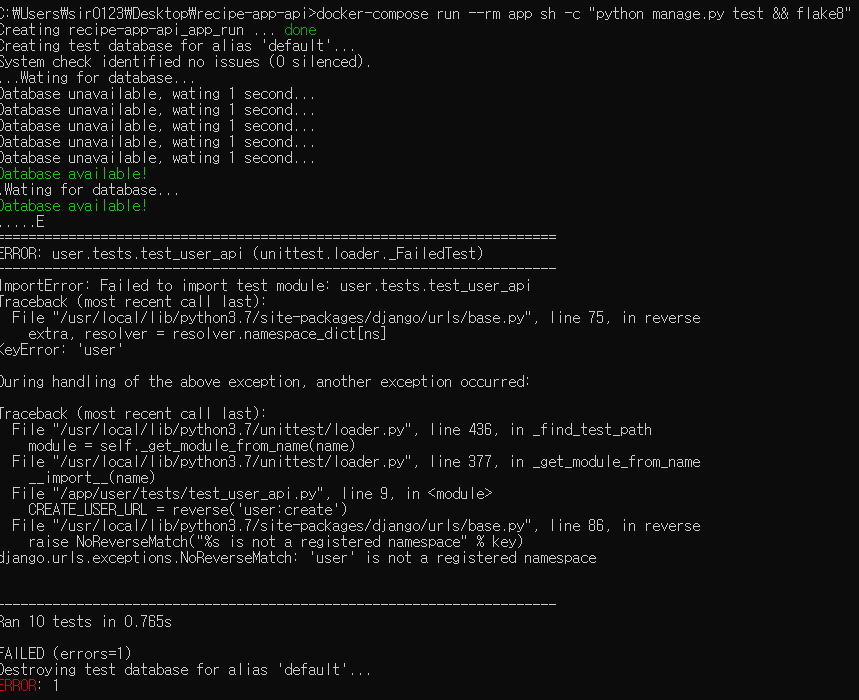

  

<br>

## :three: create user API 만들기 

 이제 create user API에 대한 코드를 작성해 주면 :two:에서 실패했던 테스트가 성공하면서 기능을 추가할 수 있다.

<br>

**create user API**

* create user 요청에 대한 serializer 생성
* create user 요청을 처리할 view 생성
* 위의 것들을 wire하여 URL로 만들고, API를 통해 접근하도록 함으로써

테스트를 성공하도록, 기능을 추가해 보자.

<br>

* `app/user/serializer.py`: user에 대한 serializer 저장(Django rest framework documentation [Model](https://www.django-rest-framework.org/api-guide/serializers/#modelserializer), [Create](https://www.django-rest-framework.org/api-guide/generic-views/#createapiview) 참고)

  ```python
  
  ```

  * `UserSerializer`: serializer 클래스 커스텀
    * Django rest framework에서 이미 제공하는 serializer를 기반으로 필요로 하는 field 특정하여 사용. database conversion 및 creating, retrieving from database 자동
    * `Meta`
      * `model`: model to base serializer from
      * `fields`: going to be converted *to and from* **JSON** when,
        * making HTTP POST
        * retriving request in the view
        * saving to the model
      * 만약 다른 필드 추가하고 싶을 때는 뒤에다가 추가 가능
      * `extra_kwargs`: extra keywords(restrictions for the `fields` reference)
        * configure a few extra settings to the model serializer
        * ensure that the password is *WRITE* only, minimum length required is 5 characters
    * `create`: validated data를 이용해 유저 생성
      * 모델의 `create_user` 함수를 호출(*이 함수는 by defualt로 create 함수를 호출하는 helper 함수이기 때문*)
      * `create_user_model` 매니저 함수를 사용해서 패스워드가 암호화되어 저장되었는지 확인
    * 유저를 생성하는 API 요청이 왔을 때, Django rest framework는 이 `create` 함수를 호출하고, 인자로 사용된 `validated_data`를 넘기는데, 이 `validated_data`는 우리가 만든 serializer에 넘어 온, HTTP POST 요청에서 응답으로 넘어 온 JSON data이다. **결과적으로** 그 JSON data를 이용해 유저를 만든다!

* `app/user/views.py`: create user API를 관리하는 view 추가

  ```python
  
  ```

  * import: `render` 사용하지 않음

    * rest framework generics 모듈
    *  `UserSerializer`

  * `CreateUserView`

    * Django rest framework를 이용해 create API 뷰 생성. 이것도 역시나, creating object 목적을 위해 미리 만들어져서 제공되는! 우리가 제공할 serializer를 이용해 object 생성!
    * serializer 클래스를 지칭하는 클래스 변수 지정

    > *참고*: 이렇게만 하면 된다! 
    >
    >  Django rest framework는 API를 생성하기에 매우 쉽다! creating objects in the database와 같은 standard behavior에 대해서는 특히 더!

  

<br>

* `app/user/urls.py`: API에 접근하기 전, URL을 만들고 이것을 view에 wire(통합?)한다.

  ```python
  
  ```

  * import
    * `path`: Django에 기본으로 제공되는 helper function. define different paths in the app
    * `views`: 컨트롤러(?) 역할
  * `app_name`: 어떤 app이 reverse 함수를 써서 URL을 만드는지 알기 위해 app name 정의

  * url 패턴 정의
    * create user를 위한 경로
    * wire될 뷰: `CreateUserView`의 값을 리턴
    * name

<br>

* `app/app/urls.py`: 정의한 url 패턴을 main app URL에 업데이트

  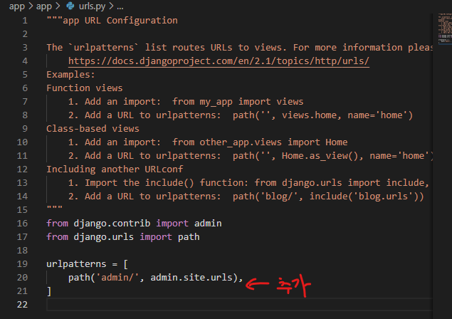

  * `path('api/user/', include('user.urls'))`

    * `api/user`로 시작하는 request URL은 `user.url`로 넘기는데, 

    * `include` 함수를 사용해서 넘김

      * define URLs as a string을 위한 helper function

      * identify user app and get the URLs module, then extend,

      * so that any request that's passed in matches this will get passed on to URLs in user model,

      * and then if it matches `create/` pattern

        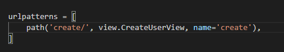

      * then get passed to views,

      * then render API,

      * then handle API requests

<br>

* 테스트 진행: flake만 아니고는 12개 테스트 성공! 이제 create user api 작동한다!

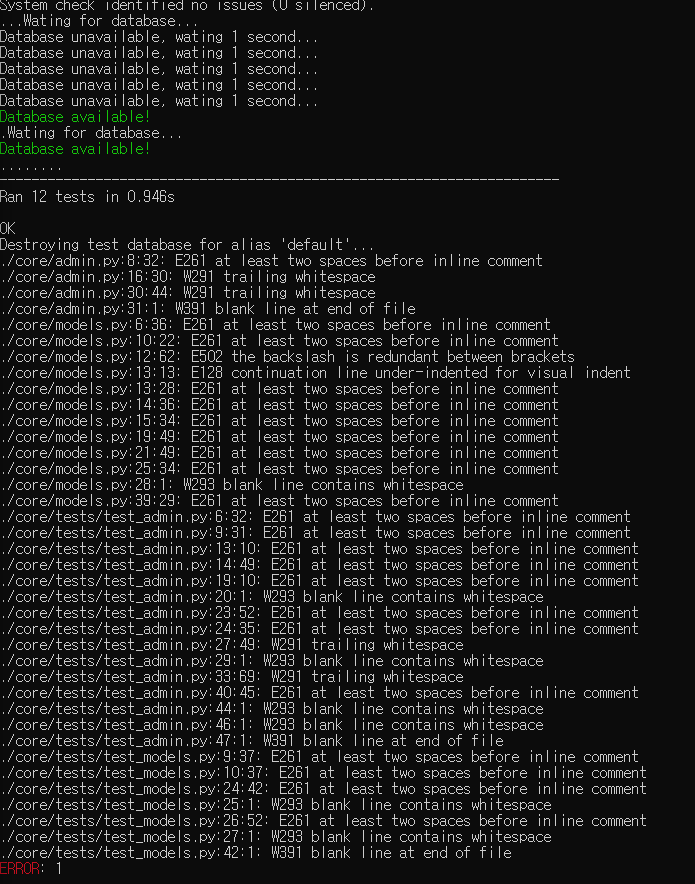

<br>

## :four: create token API 테스트

**token authentication**

* HTTP POST request로 임시 auth token을 만들고
* 해당 API를 사용할 때 future request를 authenticate

 이 API를 사용해서 token을 생성하고, 미래에 request 시 authentication header로 제공한다. 이렇게 하면, request를 보낼 때마다 user의 username, password를 모두 전송하지 않아도 된다. 

 토큰을 만들기 위해 한 번만 request를 보내고, 그것을 계속해서 사용하면 된다는 말. 만약 다시 사용하고 싶다면, revoke token in the database!

<br>

* 테스트: `app/test/test_user_api.py` 파일에 4개의 unit test 추가

  ```python
  
  ```

  * `user:token`: token constant variable → token 발급에 대한 HTTP POST 요청 시 URL

  * authentication을 시작하는 것이 목적이므로, 해당 API에는 authentication을 추가하지 않아도 된다 → Public User API test에 추가!
  * `test_create_token_for_user`: 토큰이 제대로 만들어졌는지 체크. 
    * 유저가 만들어졌으니 database에 토큰이 있어야 함
    * Django 기본 authentication system을 사용하므로, 토큰이 있어야! 굳이 그 자체에 대해서 테스트 코드를 작성하고 duplicate test를 할 필요가 없다! 장고를 믿어라!
    * HTTP 200인지도 확인
  * invalid credential 제공 시 어떤 일이 발생하는지 체크
    * 일부러  틀린 패스워드
  * 존재하지 않는 유저에 권한을 부여하려 할 때 체크
  * 패스워드를 포함하지 않는 요청

* 테스트 실행: fail! token url 안 만들었으니 당연히 실패!

  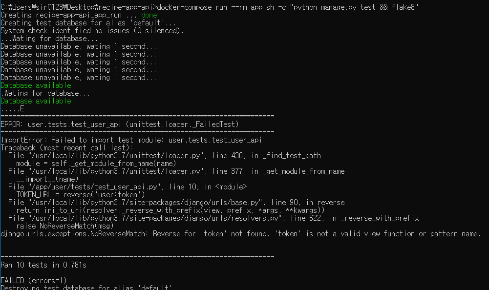


<br>

## :five: create token API 만들기


* `app/user/serializers.py`: `AuthTokenSerializer` token serializer 생성

  ```python
  
  ```

  * import
    * `ugettext_lazy`
  * `validate`: when overriding `validate`, then must return attributes

​	

<br>

* `app/user/views.py`: auth token을 얻는 view 만들기

  ```python
  
  ```

  * import
    * `ObtainAuthToken`
  * `renderer`: setting renderer so as to view this endpoint in the browser with the browsable API
    * 즉, 크롬 브라우저든 뭐든 로그인을 해서, post를 위한 클릭을 하면, 토큰 반환
    * 이거 없이는, HTTP POST 요청을 보내기 위해 `c:url` 등 다른 방법을 사용해야
  * 

<br>

* `app/user/urls.py`: auth token url 만들기

  ```python
  
  ```

  

  * 기존에 만든 `create` url pattern 밑에 다른 pattern 생성
  * 

<br>

* 테스트 진행: 성공

  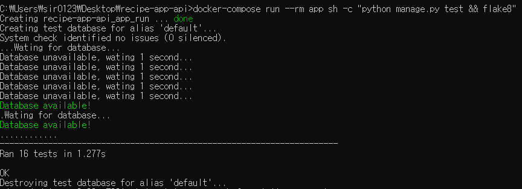

<br>

* browser에서 테스트

  * 앱 실행: `docker-compose up`

    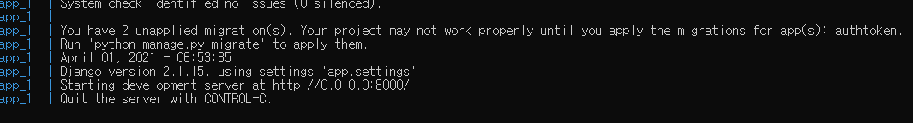

  * `127.0.0.1:8000` 접속: url pattern 맞춰서 들어가야 함

    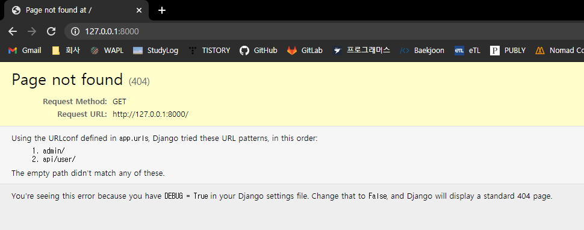
    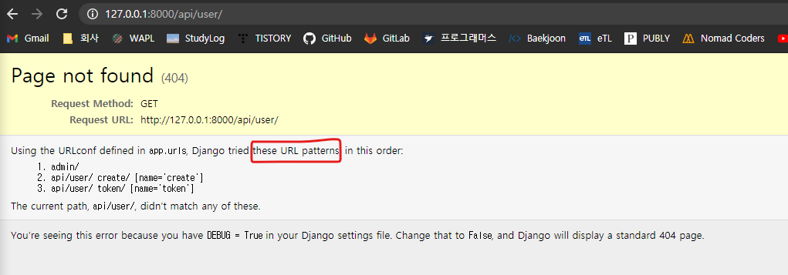

    | /api/user/create/                                            | /api/user/token/                                             |
    | ------------------------------------------------------------ | ------------------------------------------------------------ |
    | 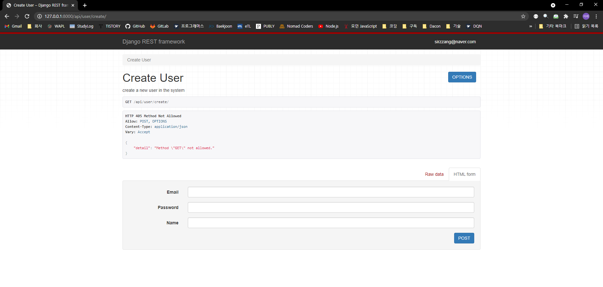 | 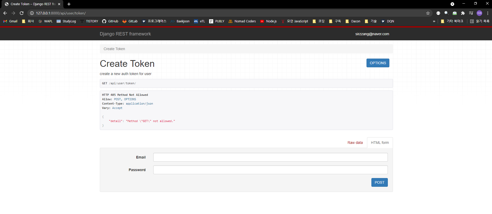 |

  * create post를 만들어 보자

    * 패스워드가 짧으면

      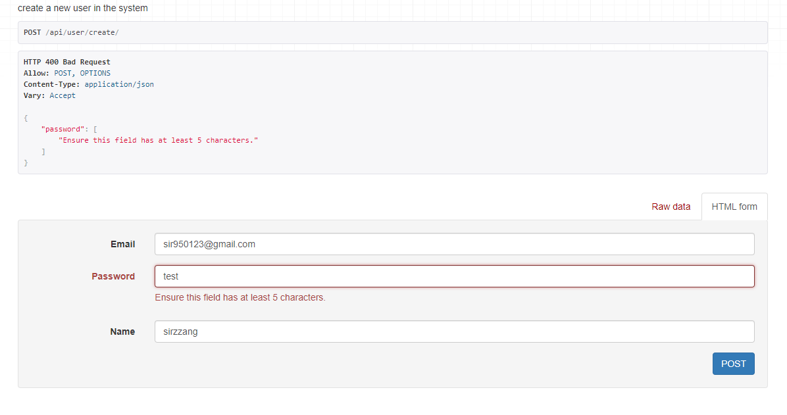

    * 정상적으로 되면

      

    * 이미 존재하는 유저면

      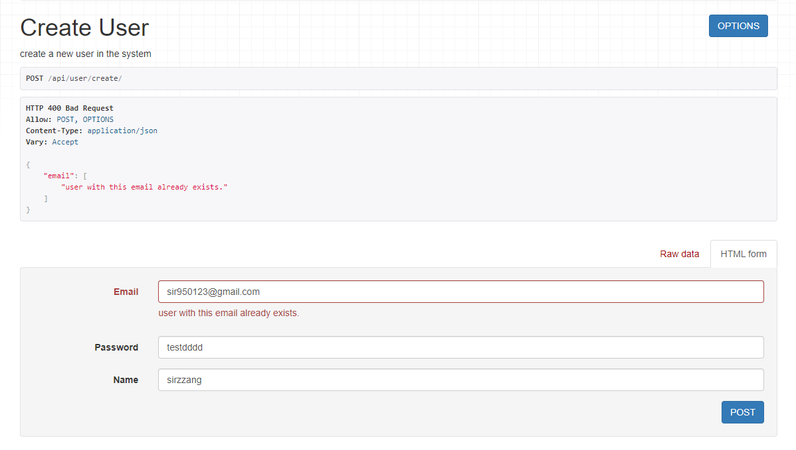

  * token을 발급해 보자

    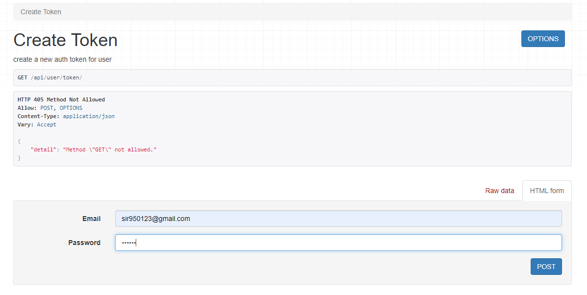

    * 올바르지 않은 비밀번호일 때

      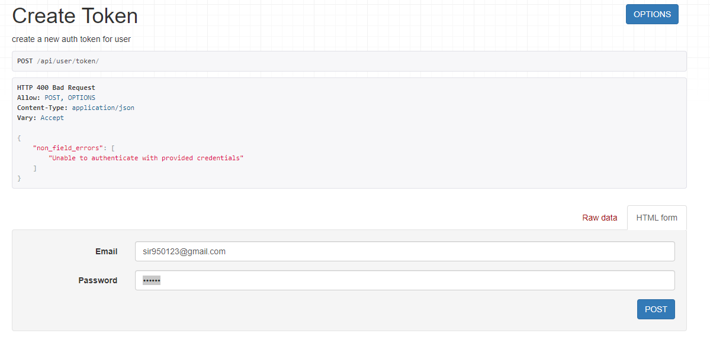

    * 정상적으로 되면

      

      > *참고*: database migration 필요하다!
      >
      >  아래와 같은 오류가 나면 migration을 해 주자.
      >
      > 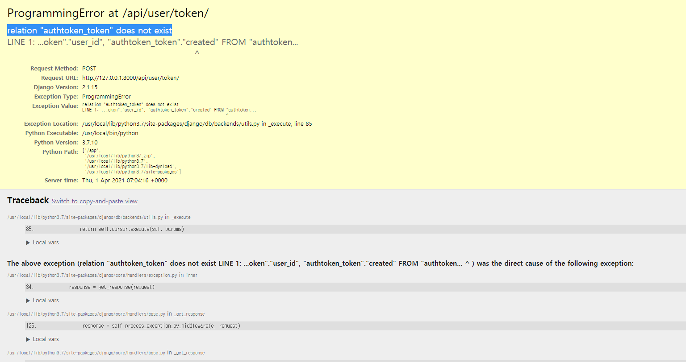
      >
      > 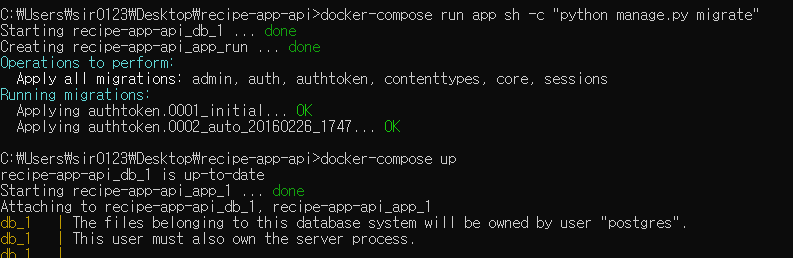

      

    * 어쨌든 토큰을 발급받으면,
      * 쿠키든, persistent storage든 저장해 놓고,
      * 나중에 request 올 때 authenticate 가능


<br>

## :six: manage user endpoint 테스트

<br>

**manage user endpoint**


 authenticated user가 자신의 프로필을 업데이트하고, 프로필 값이 각각 무엇으로 설정되어 있는지 확인할 수 있도록 한다.

* changing the name
* changing the password
* viewing user object

<br>

* `app/user/tests/test_user_api.py`: 테스트 코드 작성

  ```python
  dd
  ```

  * URL 추가: `ME_URL`

  * **public** test
    * `test_retrieved_user_unauthorized`: manage user endpoint에 authentication이 있는지 확인
      * unauthenticated user 자격으로 확인해야 authentication 여부 확인 가능
      * `HTTP_401_UNAUTHORIZED`: without authentication
  * `PrivateUserApiTests` **private** test: authentication is required before using *these* endpoints
    *  `setUp`: user 만든 후, 클라이언트 설정(*=public에서와 동일*) 뒤, authenticate 메소드 사용(force)
      * `force_authenticate`: helper function making easy to simulate or authenticating requests
      * 현재 테스트용으로 만든 유저 클라이언트가 unauthenticated user이므로
    * `test_retrieve_profile_success`
      * HTTP 200 response 받았는지
      * password가 클라이언트 단에 있어야 할 필요가 없으므로, 패스워드는 테스트 시 제외
    * `test_post_me_not_allowed`: HTTP POST 요청 불가능한지 테스트
      * `HTTP_405`: not allowed response
    * `test_update_user_profile`: 유저 프로필이 업데이트되는지 테스트
      * patch request 사용
      * `refresh_from_db`: helper function to refresh DB or update DB with the latest values

* 테스트 진행: url 없으므로 fail!

     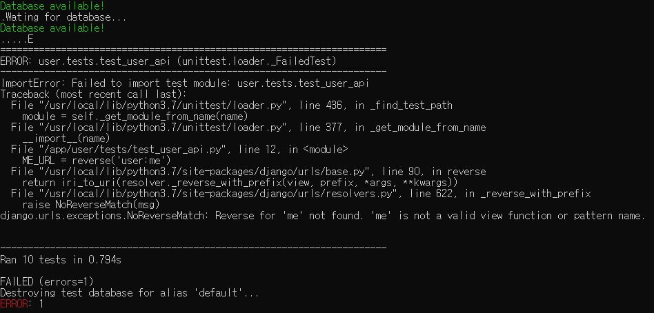

<br>


## :seven: manage user endpoint API 만들기

<br>

**mange user API url**

* 이미 존재하는 user serializer를 이용하나, user object를 업데이트하기 위해 user serializer에 새로운 함수를 추가한다.

* retrieve update API 뷰를 사용하는 커스텀 뷰: Django rest framework generic API

<br>

* `app/users/views.py`

  ```python
  
  ```

  

  * import: `authentication`, `permissions` 추가
  * `ManageUserView`
    * class variable


<br>

* `app/users/serializers.py`

  ```python
  
  ```

  * `update` 추가

    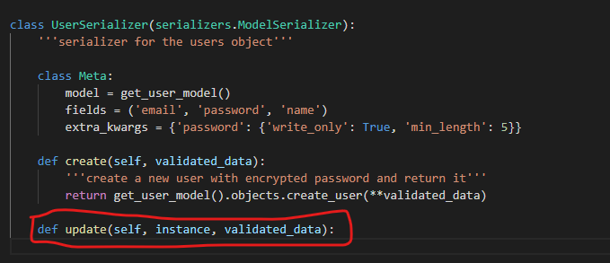

<br>

* `app/users/urls.py`

<br>

* 테스트 진행: 성공!

  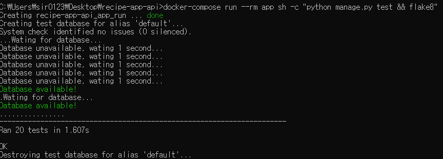

<br>

* 브라우저에서 테스트

  * 유저 혹은 관리자(superuser)에 대해 발급받은 토큰

  * mod header 크롬 확장프로그램을 이용해 

    

    * request에서 헤더 값을 변경할 수 있도록
    * API를 통해 authentication을 시뮬레이션하고 테스트할 수 있음
    * 발급받은 토큰을 복사하고, 다음과 같이 입력

    

  * `users/me` API 접속
    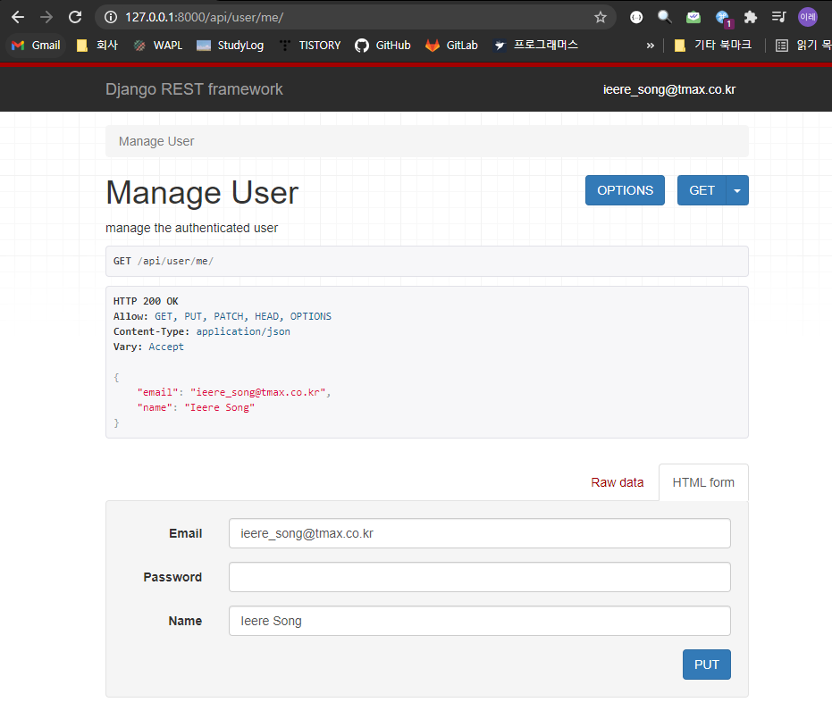

    * put 요청을 통해 값을 바꿔 보면

      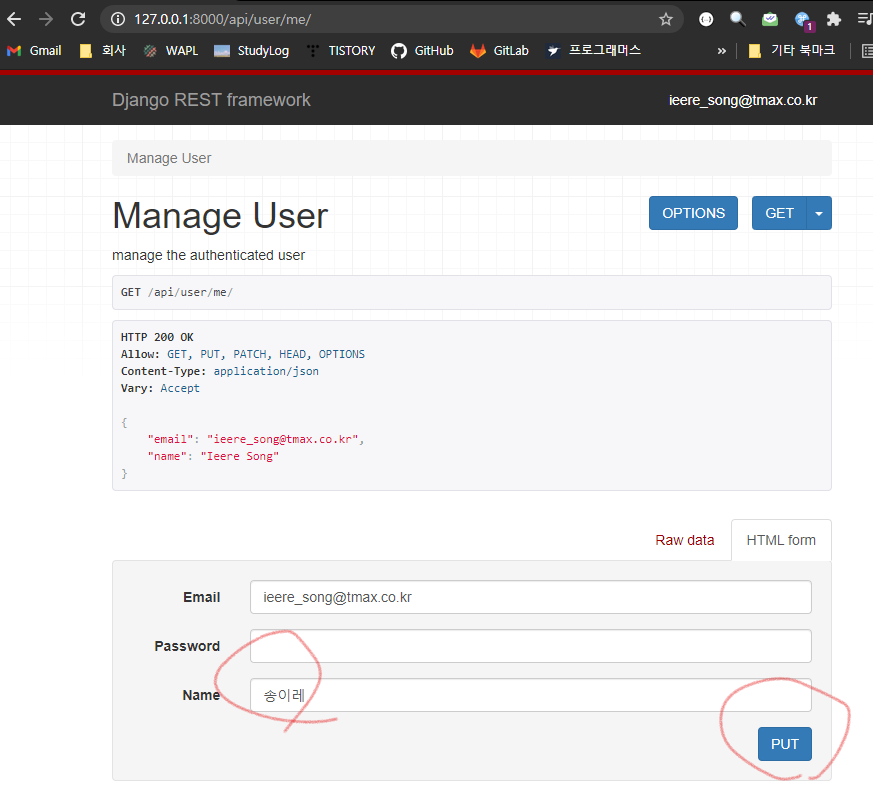

      * 패스워드 입력하지 않으면 오류

        

      * raw data에서 수정 후 patch 요청

        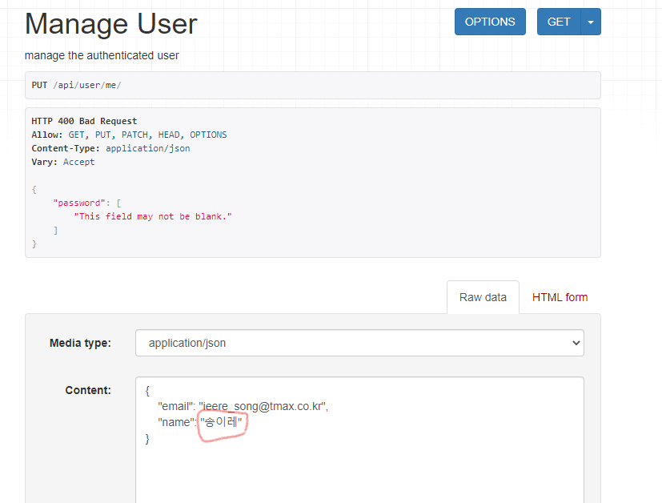

    * patch 요청하면 성공

      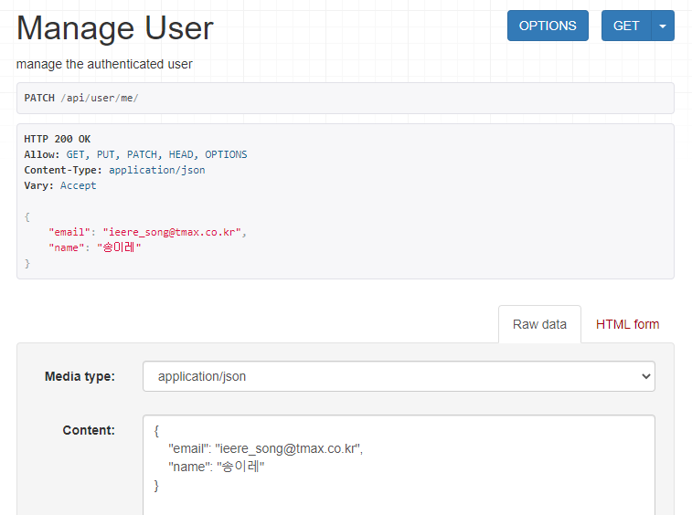

  > *참고*: put vs. patch
  >
  > * put: update and replace the entire object
  > * patch: *only* updates the values provided


<br>