# Django Custom User Model


## :one: create core app and start building project

* core app
  * hold all of the central code that is important to the rest of the sub apps
  * create anything that is shared between one or more apps → things like *migrations, database* should be in a core module

<br>

* `django manage` 커맨드 이용해서 터미널에서 core app 만들기
  * run `manage.py` helper script by using Python
  * will create a new core app in the project

```shell
docker-compose run app sh -c "python manage.py startapp core"
```

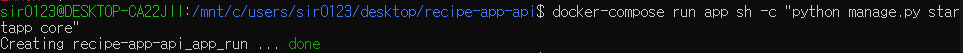

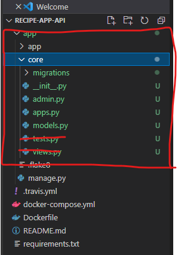

* 만든 후 삭제해야 할 파일
  
  * `tests.py`: core app에서 테스트 파일을 삭제하는 이유는, 테스트로 시작하는 것들을 다 테스트 폴더 안에 모아 놓기 위함
* `views.py`: core app에서 views도 필요 없음. views won't be serving anything. it justs simply **holds the database models**
  
* `app/core/tests` 폴더 생성: 테스트 코드 한 곳에 모아 놓는 폴더
  
  
  
  * `app/core/tests/__init__.py` 생성
  * easily scale up the tests if necessary


##  :two: add tests for custom user model

**TDD**: write test first, and then implement the model afterwards

<br>

* `app/app/settings.py`: 설치된 앱에 `core` 앱 추가

  ```python
  ...
  
  INSTALLED_APPS = [
      'django.contrib.admin',
      'django.contrib.auth',
      'django.contrib.contenttypes',
      'django.contrib.sessions',
      'django.contrib.messages',
      'django.contrib.staticfields',
      'core', # 추가
  ]
  
  MIDDLEWARE = [
     'django.middleware.security.SecuriyMiddleware',
      ...
  ]
  ```

  

* `app/core/tests/test_models.py`

  * test if helper function for the model can **create a new user**
    * create user function
    * verify that the user has been created as expected
  * import helper function that comes with Django to get model 
    * models에서 직접 import하는 것은 비추. 언젠가는 user model을 바꾸고 싶을 수도!
    * `user manager`의 `get_user_model`의  `create_user` 함수: 나중에 만들 것
  * email과 password를 인자로 받아 유저가 만들어 졌는지, 이메일 주소가 맞고, 비밀번호가 맞는지 테스트
    * `create_user` 함수를 만들면 `user` 변수에 할당되는 user 객체가 있을 것
    * 이메일과 달리, 비밀번호는 암호화되기 때문에 같은 방식으로 테스트할 수 없음 → user model의 `check_password` 함수 사용
      * `assertTrue`: `True`인지 확인
        * `check_password` function: helper function that comes with the Django user model
        * `check_password` function will return `True` if the password is correct

  ```python
  from django.test import TestCase
  from django.contrib.auth import get_user_model
  
  class ModelTests(TestCase):
      
      def test_create_user_with_email_successful(self):
          '''Test creating a new user with an email is successful'''
          email = 'sirzzang@naver.com'
          password = 'Testpass123'
          
          # create_user 함수로 user가 만들어지는지 확인    
          user = get_user_model().objects.create_user(
              email=email,
              password=password
          )
          
          # 이메일과 비밀번호가 맞는지 테스트
          self.assertEqual(user.email, email)
          self.assertTrue(user.check_password(password))
  ```

  * unit test 진행
    
    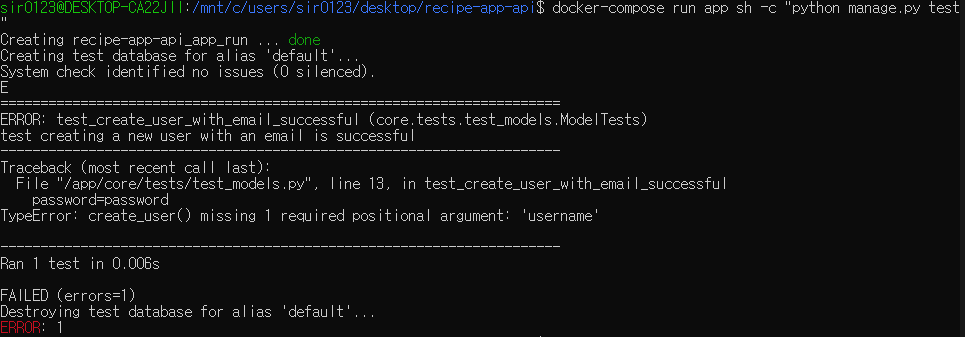
  
    * 아직 새로운 기능을 추가하지 않았기 때문에, fail해야
    * `username`이 없다는 오류가 뜨는데, `user model`을 커스터마이징하지 않았고, Django가 디폴트로 사용하는 `user model`의 standard username 필드를 사용할 것을 기대하기 때문
  
  ```shell
  docker-compose run app sh -c "python manage.py test"
  ```


<br>

## :three: create custom user model


- create a user model in `models.py` file in the core app
- update `settings.py` file to set custom auth user model

<br>

* `app/core/models.py`

  ```python
  from django.db import models
  from django.contrib.auth.models import AbstractBaseUser, BaseUserManager, PermissionsMixin
  
  
  class UserManager(BaseUserManager): # extends BaseUserManager 
  ```

  * 주석 제거
  * extend the Djang user model while making use of some of the features that come with the django user model out of the box
    * `AbstractBaseUser`	
    * `BaseUserManager`
    * `PermissionsMixin`
  * `UserManager` class: class providing the helper functions for creating a user or creating a super user
    * extends `BaseUserManager`
      * pull in all of the features that come with Django `BaseUserManager`
      * override some functions to handle email address. 원래, `BaseUserManager`는 username을 받아야 하므로 오버라이딩 필요.
  * 


 이제 make migrations!

* migration을 위한 앱의 이름을 명시하면(필수는 아니지만) 좋음

* database migration: migiration files 생성
  * Django creates the model in the real database that we use
  * migrations
    * used when setting up the database
    * every time making a change to the models, then make migrations again

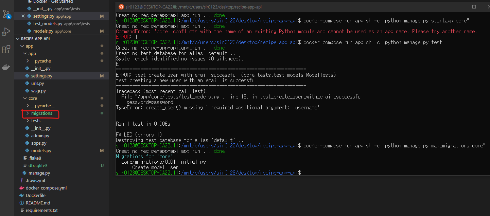

<center><sup>migrations 파일 생성</sup></center>


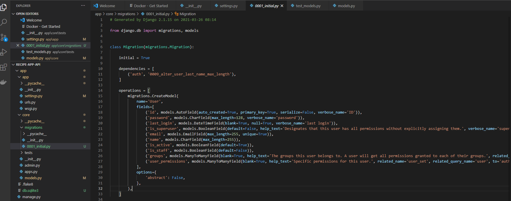

<center><sup>migrations 파일 내용</sup></center>

<br>

* 테스트 진행: 성공!

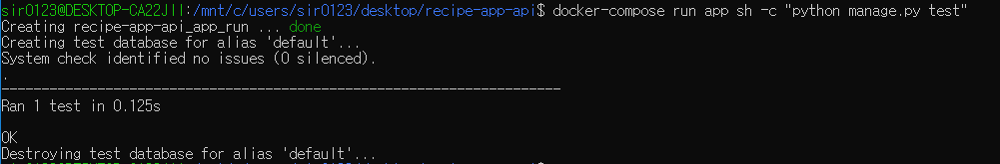

<br>


## :four: add new features to custom user model

 새로운 기능 추가를 위해 여전히 `test_models.py`에 새로운 테스트 코드를 작성한 후 작업 진행

<br>

* normalize email address

  * test code 작성

  * test 진행: fail

    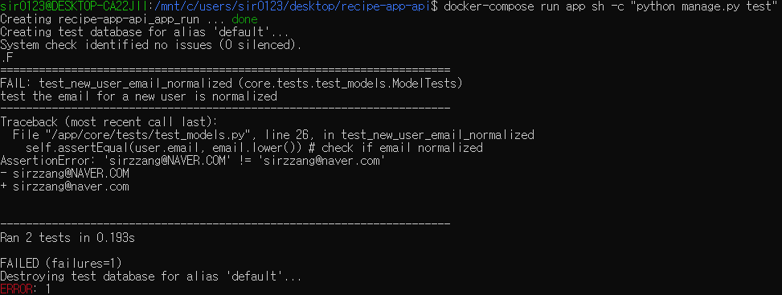

  * implement new feature at `models.py`: helper function 이용

  * test 진행: 성공!

    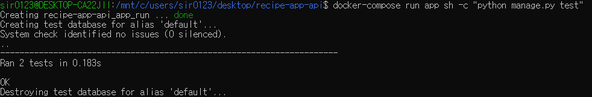

<br>

* validate email address

  * test 코드 작성

    * blank, non value 등을 넘겼을 때 `raise value error`
    * `with self.assertRaises`: value error를 일으키지 않으면 test fail!

    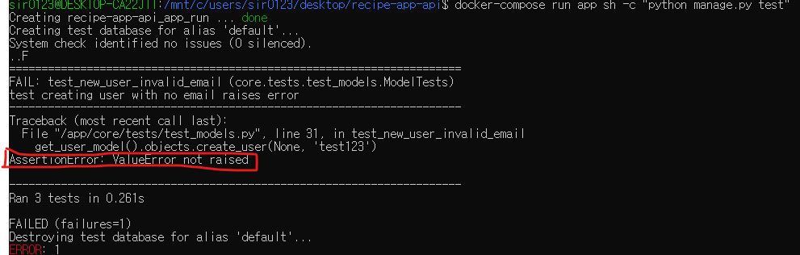

  <center><sup>ValueError가 일어나지 않아서 에러</sup></center>

  * implement validation feature
  * test 진행: 3개 모두 성공!

  


<br>

* add support for creating superusers

  * **create super user**: a function used by Django CLI when creating new users with command line → should be included in custom user model, so as to take advantage of the Django management command for creating a super user

  * test 코드 작성: `create_superuser`를 만들지 않았으므로 fail

    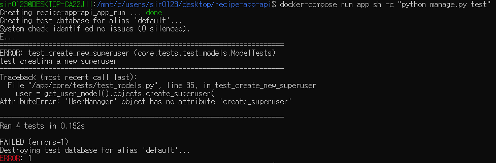

  * implement new feature
    * command line에서만 사용하므로 `extra_fields`는 없어도 무방
  * test 진행: 4개 모두 성공!

  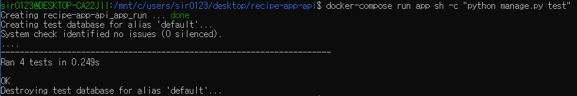


<br>

* 기능 추가 완료 후 flake8을 통해 linting

  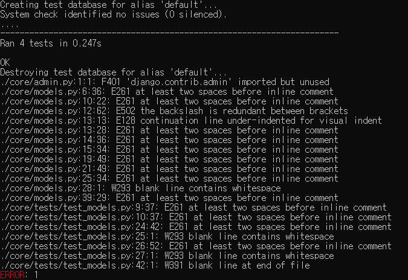

  <center><sup>..........</sup></center>

  * 강의자에게도 나타난 `django.contrib.admin` 부터 해결: `app/core/admin.py` 주석 처리!
  * 나머지는 나중에...


