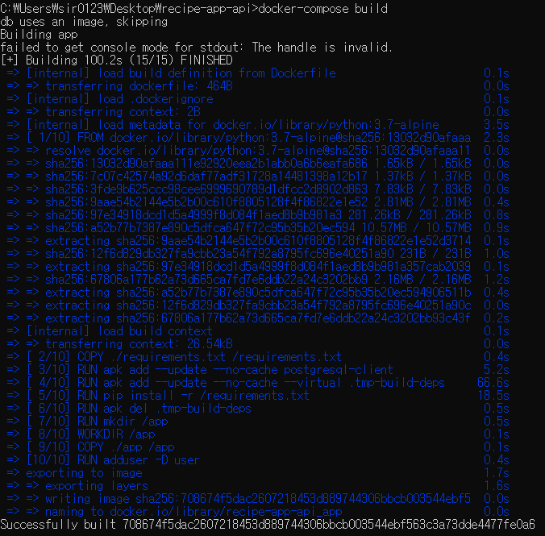

# Set up Database

* Django default: sqlite
* 강의에서는 postgres DB를 사용하도록 변경

<br>

## :one: docker-compose 파일 변경

```yaml

```


* `db` 서비스 추가

  * docker hub postgres 10 alpine 버전
  * environment variables: configuration options
    * `POSTGRES_PASSWORD`: 원래는 암호화해야. 지금은 로컬용

* `app` 서비스 변경: 환경변수, `db` 서비스 dependency

  * environment variables

    * `DB_HOST`: database를 실행하는 서비스의 이름

  * dependency: `app`이 `db`에 의존

    1. database service `db`가 `app` service보다 먼저

    2. `db` service available via the network when using hostname `db`
       - when inside `app` service, can connect to the hostname `db`
       - then `db` service will run whatever container running on `db` service

<br>

## :two: postgres service 추가

* `requirements.txt`: `psycopg2` 추가

  ```
  
  ```

  * install python package used for Django to communicate with docker
  * add dependencies to Dockerfile during build process

* `Dockerfile`

  ```
  
  ```

  * `psycopg2`를 설치하기 위해서 필요한 dependency

    * `apk`: package manager
    * `update`: update registry before add
    * `no-cache`: don't store registry index on docker file

  * temporary packages that need to be installed while running requirements, and then remove them after the requirements has run (→*minimal footprint*)

    * `virtual [alias]`: alias for dependencies to easily remove later
    * `[alias]` 뒤에 필요한 모든 임시 dependency 작성

    > *참고*: dependency를 어떻게 알 수 있을까?
    >
    >  trial and error... a lot of searching around... no clear easy way... ~~마치 jekyll blog에서 수많은 시행착오를 겪으며 dependency를 맞췄던 그런 느낌...~~

  * `requirements.txt`에 있는 것 설치: `psycopg2`까지 설치될 것

  * delete temporary dependencies

* 빌드!



<br>

## :three: configure DB in Django

* `app/app/settings.py`: database configuration 변경

  * `ENGINE`: 사용할 db
  * `HOST`, `NAME`, `USER`, `PASSWORD`: `os` 모듈을 통해 environment variable에서 추출

  


